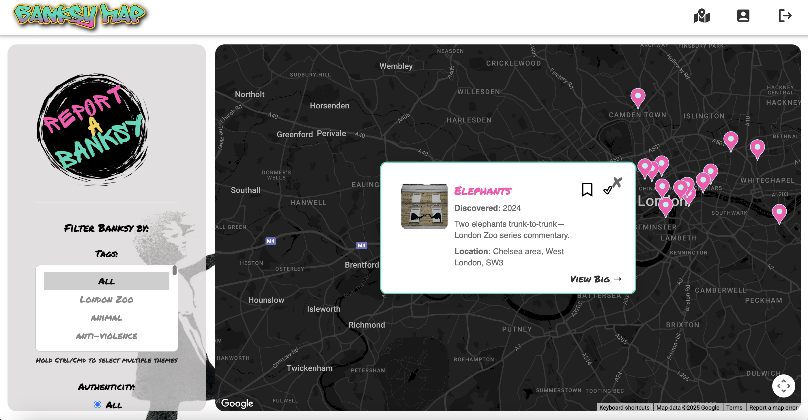

# Banksy Graffiti Map - London

 

An interactive map showcasing Banksy's graffiti artworks in London. Discover, explore, and track your visits to these iconic street art pieces with custom pins, filtering options, and achievement badges.

## CI/CD Pipeline 🚦

We have a GitHub Actions workflow (`test.yaml`) that runs **API & Frontend tests** on every pull request to keep the code error-free.

Here’s an overview on what it does:

- 🏁 Checks out the repo to grab all the latest code  
- 🧪 Sets up Node.js v24 environment  
- 📦 Installs backend dependencies in the `api` folder  
- 🧑‍🔬 Runs backend tests with a MongoDB service spinning up for a test database  
- 📦 Installs frontend dependencies in the `frontend` folder  
- 👨‍🎨 Runs frontend tests with environment secrets for API keys and URLs  
- 🧹 Runs the frontend linter to keep the code clean and consistent  

You can check the live status and logs here:  
[](https://github.com/nicmakomva/banksymap/actions/workflows/test.yaml)

## Features

- 🗺️ Interactive Google Maps implementation with custom artwork pins
- 🖼️ Pin previews showing graffiti images, addresses, and details
- 🔍 Filter artworks by category (animals, politics, peace, etc.)
- 📍 Find the nearest Banksy artwork to your current location
- 🔖 Bookmark artworks you want to visit
- ✅ Mark artworks you've visited
- 🏆 Earn achievement badges based on visited artworks (e.g., "Animal Enthusiast", "Peace Maker")
- 💬 Comment on artworks (requires login)
- 🔄 Real-time sync between map and user profile

## Tech Stack

**Frontend:**
- React (Vite)
- Context API for state management
- Google Maps JavaScript API
- Geolocation API
- Modern CSS styling

**Backend:**
- Node.js/Express server
- MongoDB (Mongoose ODM)
- JWT authentication
- AWS S3 for image storage (optional)

**Architecture:**
- MVC (Model-View-Controller) pattern
- RESTful API design

## Installation

### Prerequisites

- Node.js v23 (recommended to install via nvm)
- MongoDB (local or remote)
- Google Maps API key
- Google Geocode API key

### Setup

1. **Install Node Version Manager (nvm) and Node.js:**

   ```bash
   brew install nvm
   nvm install 23
2. **Install MongoDB (local option):**

    ```bash
    brew tap mongodb/brew
    brew install mongodb-community@6.0
    brew services start mongodb-community@6.0

3. **Clone the repository and install dependencies:** 
    ```bash
    cd frontend
    npm install
    cd ../api
    npm install    

4. **Environment Setup:**
Create .env files in both frontend and api directories with the following variables:

    **frontend/.env:**

        VITE_BACKEND_URL="http://localhost:3000"
        VITE_GOOGLE_MAPS_API_KEY="XXXXXXX"
        VITE_GOOGLE_GEOCODE_API_KEY="YYYYYYY"   

    **api/.env:**

        MONGODB_URL="mongodb://0.0.0.0/YOURDB_NAME"
        NODE_ENV="development"
        JWT_SECRET="your_secret"
        AWS_ACCESS_KEY_ID="XXXX"             # Only if using AWS S3
        AWS_SECRET_ACCESS_KEY="YYYYYYYY"     # Only if using AWS S3
        AWS_REGION="xx-xxxx-0"               # Only if using AWS S3
        S3_BUCKET_NAME="your-bucket"         # Only if using AWS S3

5. **Import Seed Data:**
    ```bash
    cd api
    npm run data:import

## Running the Application

1. **Start the backend server:**
    ```bash
    cd api
    npm run dev

2. **Start the frontend development server:**
    ```bash
    cd frontend
    npm run dev

3. **Access the application:**

Open your browser and navigate to:

    http://localhost:5174/

## User accounts

Create a new account at http://localhost:5174/signup

Log in at http://localhost:5174/login to access:

 - Artwork bookmarking

 - Visit tracking

 - Achievement badges

 - Comment functionality

## Project structure
```
banksy-map/
├── api/                   # Backend server
│   ├── controllers/       # Route controllers
│   ├── models/            # MongoDB models
│   ├── routes/            # API routes
│   ├── seeds/             # Data seeding files
│   └── app.js             # Express server setup
│
├── frontend/              # React application
│   ├── public/            # Static assets
│   ├── src/
│   │   ├── components/    # React components
│   │   ├── context/       # Context providers
│   │   ├── pages/         # Page components
│   │   ├── services/      # Fetch functions
│   │   └── App.jsx        # Main application component
│   └── vite.config.js     # Vite configuration
│
├── .gitignore
└── README.md
